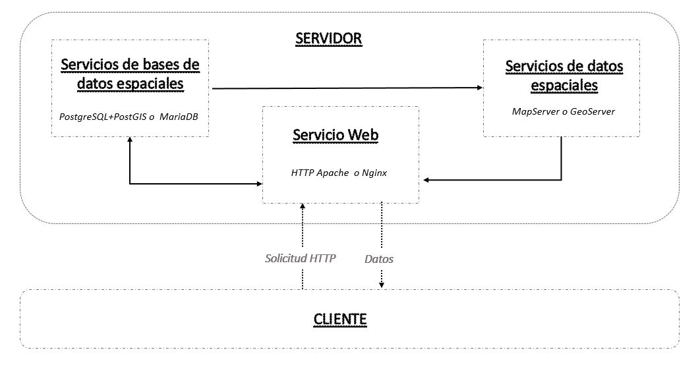
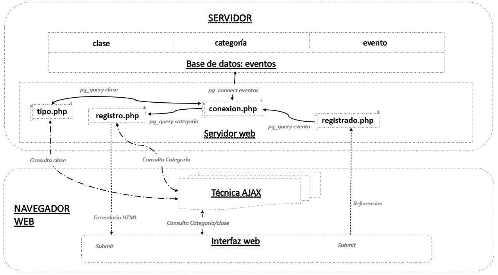
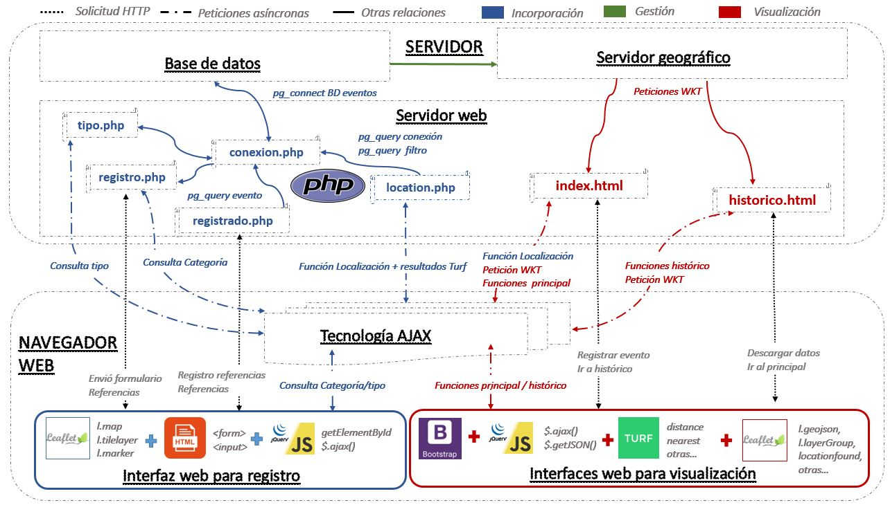

# Notas de documentación del servicio

Esta carpeta contiene los archivos para el desarrollo de la plataforma en un servidor local como paso previo a su implantación mediante docker en un servidor público.Su desarrollo se llevó a cabo con el servidor local *http XAMPP* para un sistema operativo *Windows 10*. Este paquete de *software libre* incluye el servidor web *http Apache* y el intérprete de lenguaje *PHP*, entre otras aplicaciones.Pese a que el paquete XAMPP incluía MySQL, la aplicación de base de datos elegida para desarrollar la herramienta fue *PostgresSQL* y su extensión para bases de datos espaciales *PostGIS* dada su interfaz gráfica y su potente capacidad. 



Como complemento para la salida gráfica de los datos con componente espacial se opta por el uso de la aplicación *GeoServer* que sirve los datos según el estándar *WKT* que está definido por el *OGC* con el objeto de describir objetos espaciales expresados de forma vectorial.Pese a que el paquete XAMPP incluía MySQL, la aplicación de base de datos elegida para desarrollar la herramienta fue *PostgresSQL* y su extensión para bases de datos espaciales *PostGIS* dada su interfaz gráfica y su potente capacidad. Como complemento para la salida gráfica de los datos con componente espacial se opta por el uso de la aplicación *GeoServer* que sirve los datos según el estándar *WKT* que está definido por el *OGC* con el objeto de describir objetos espaciales expresados de forma vectorial.

| Aplicación | Versión | Función | 
| -- | -- | -- |
| [PostgreSQL](www.postgresql.org) | 11 | Base de datos |
| [PostGIS](www.postgis.net) | 2.5.3 | Contenido espacial de la base de datos|
| [Geoserver](www.geoserver.org) | 2.17 | Servidor geográfico |
| [Apache](www.apache.org) | 2.4 | Servidor web |


## Lenguajes, librerías y extensiones

El software *HTTP Apache* es elegido para realizar las funciones de servidor web al ser el más utilizado a nivel mundial, este albergará los procedimientos de la herramienta, entre ellos los asociados a un SIG. Estos procedimientos se definen a través de las instrucciones dadas por los lenguajes de programación.

Tabla: Lenguajes, librerías y extensiones de la plataforma

| Lenguaje | Tipo de lenguaje | Librería/Extensión | Función |
| -- | -- | -- | -- |
| [PHP](https://github.com/Leaflet/Leaflet.heat) | Lado servidor |   | Conexión y consulta a base de datos |
| |  |  [pgsql](https://www.php.net/manual/en/ref.pdo-pgsql.php) | Permite la conexión a una base de datos PostgreSQL |
| [XML](https://developer.mozilla.org/es/docs/Web/XML) | Lado cliente/servidor |   | Transferencia de datos | 
| [GeoJSON](https://geojson.org/) | Lado cliente/servidor |  | Visualización y transferencia de datos |
| [HTML](https://developer.mozilla.org/es/docs/Web/HTML) | Lado cliente |   | Desarrollo de página web | 
| [CSS](https://developer.mozilla.org/es/docs/Web/CSS) | Lado cliente |   | Diseño de página web | 
|  |  | [Bootstrap](https://getbootstrap.com/) | Contiene plantillas basadas en *HTML* Y *CSS* |  
| [JavaScript](https://developer.mozilla.org/es/docs/Web/JavaScript) | Lado cliente |   | Implementación funciones complejas|
| |  | [jQuery](www.jquery.com)  | Funciones asíncronas con la técnica AJAX |
| |  | [Turf](www.turfjs.org)  | Análisis espacial |
| |  | [Leaflet](https://leafletjs.com/)  | Representación de mapas interactivos |
| |  | [Leaflet.heat](https://github.com/Leaflet/Leaflet.heat) | Representación de mapas de calor |

## Incorporación de información

En esta sección se describen las aplicaciones y lenguajes que participan en la incorporación de información a la plataforma.

### Conexión 

La conexión se realiza con la función [pg_connect()](https://www.php.net/manual/es/function.pg-connect.php) que se alimenta de parámetros a través de la variable *$cadena* y esta contenida por la variable *$conn* que devuelve el exito de la conexión o el fracaso a traves de la función [pg_last_error](https://www.php.net/manual/es/function.pg-last-error.php) que obtiene una cadena con el último mensaje de error de la conexión.

```php
<?php
$cadena =
    "host='localhost'
    port='5432'
    dbname='_____'
    user='postgres'
    password=______";

$conn=pg_connect($cadena) or die ("Error de conexión." . pg_last_error());
echo "Conexión existosa <hr />";
?>
```

### Recogida de datos georrefenciados sobre evento culturales a traves de un formulario HTML



La incorporación de información a la tabla `evento` se realiza a través de un [formulario HTML](https://developer.mozilla.org/es/docs/HTML/HTML5/Formularios_en_HTML5). Este debe comenzar con la etiqueta [`<form>`](https://developer.mozilla.org/es/docs/Web/HTML/Elemento/form) y terminar con la etiqueta [`</form>`](https://developer.mozilla.org/es/docs/Web/HTML/Elemento/form), que posee atributos como [`method`](https://developer.mozilla.org/es/docs/Web/HTTP/Methods) que determina la forma en que esta información es enviada. 

```html
<form name= "registrar" action="registrado.php" method="POST" enctype="multipart/form-data">
```
Otros atributos como `action` que determina la página a la que se enviara la información recogida en el formulario ycomo *action* manda los datos del formulario a la dirección indicada cuando se pulsa el [`<input>`](https://developer.mozilla.org/es/docs/Web/HTML/Elemento/input) de tipo `submit` que se encuentra al final del formulario.
```html
    <div class="form-group">
        <input type="submit" name="registrar" id="registrar">
    </div>
</form>
```
Este formulario contiene [`<inputs>`](https://developer.mozilla.org/es/docs/Web/HTML/Elemento/input) de diferentes tipos. Aunque solo algunos de ellos enviarán información al servidor. A saber; dos cuadros de menú desplegable vinculados por una consulta con la tecnología [AJAX]((https://developer.mozilla.org/es/docs/Web/Guide/AJAX)); por la que en el segundo se cargan los tipos dependiendo de la categoría seleccionada en el primero, cinco cuadros de texto para la latitud, la longitud, el nombre, el organizador y la *url*, un cuadro de área de texto para la descripción, dos cuadros de fecha para el inicio y el final, dos cuadros de numéricos para el precio y el aforo y por último, un botón para dar por finalizado el formulario.

Tabla: Tipos de elementos del formulario *HTML*

|Tipo| Obligatorio|Enviado|Campo tabla `evento`|
|--|--|--|--|
|selecionable|Sí|No||
|selecionable|Sí|Sí|`tipo_evento`|
|texto|Sí|Sí|`geom_evento`|
|texto|Sí|Sí|`geom_evento`|
|texto|Sí|Sí|`nombre_evento`|
|texto|Sí|Sí|`organizador_evento`|
|área texto|Sí|Sí|`descripción`|
|fecha|Sí|Sí|`inicio_evento`|
|fecha|No|Sí|`final_evento`|
|archivo|No|Sí|`imagen_final`|
|texto|No|Sí|`url_evento`|
|numérico|No|Sí|`precio_evento`|
|numérico|No|Sí|`aforo_evento`|
|botón|Sí|No||

En el primer cuadro seleccionable se realiza una consulta a la base de datos y a través de la función [pg_fetch_array](https://www.php.net/manual/es/function.pg-fetch-array.php) se despliegan las columnas como un *array* del que se mostrará el campo nombre y se tomará como valor el id.


```php
        <?php
            include ('conexion.php');
            $query = "SELECT * FROM categoria_evento";
            $do = pg_query($conn, $query);
            while($row = pg_fetch_array($do)){
            echo '<option value="'.$row['id_categoria'].'">'.$row['nombre_categoria'].'</option>';}
        ?> 
```

Debido al diseño de nuestra base de datos y la relación entre tablas la selección de una categoría de evento permitirá seleccionar unos determinados tipos de evento asociadas a esta categoría. Se utiliza la técnica [AJAX](https://developer.mozilla.org/es/docs/Web/Guide/AJAX) que se engloba dentro de las Aplicaciones Ricas de Internet que se cargan al inicio y transmite unicamente los datos requeridos por el usuario sin volver a cargar la página.

Se indica que cuando cambie el *id* de categoría lista, seleccionado a través con la consulta anterior, se introduza en la variable `id_categoria`. Entonces a tráves de [jQuery](https://jquery.com/), librería de código libre de [JavaScript](https://www.javascript.com/) y su API [jQuery.ajax](https://api.jquery.com/jquery.ajax/) para realizar una solicitud HTTP (Ajax) asincrónica, a la url indicada donde esta la consulta a la base de datos, método POST y con el valor de la variable creada en formato de texto.


```js
<script type="text/javascript">

    $(document).ready(function(){
        $('#categoria_lista').change(function(){
            var idcategoria=$(this).val();
                $.ajax({
                    url:"tipo.php",
                    method: "POST",
                    data:{idcategoria},
                    dataType:"text",
                    success: function(data){$('#tipo_lista').html(data);}
                        });
                                                });
                                });
</script>
```
La respuesta asgina al *id* de tipo lista los valores resultantes de la consulta que podemos ver en el archivo [tipo.php](/www/tipo.php). Por la que selecciona las tipos de evento visualmente por nombre y recogiendo el valor del *id* de tipo, que comparten el valor de *id* categoría seleccionada previamente y las desvuelve.

```php
    <?php
        include "conexion.php";
        $output='';
        $sql= "SELECT * FROM tipo_evento WHERE id_categoria='".$_POST["idcategoria"]."'";
        $result = pg_query($conn, $sql);
        $output='<option value="">Selecciona una tipo de evento</option>';
            
            while($row=pg_fetch_array($result))
                {
                $output .= '<option value="'.$row["id_tipo"].'">'.$row["nombre_tipo"]. '</option>';       
                }
        echo $output;
    ?>
```

Otro de los atributos dentro de [<*form*>](https://developer.mozilla.org/es/docs/Web/HTML/Elemento/form) es `enctype` solo usado con `POST` y que codifica los *"multipart/form-data"*, como las imagenes.

```html

 <div class="form-group">
    <h3>Imagen del evento</h3>
    <input type="file" name="imagen">
</div>
```
#### Recogida de datos espaciales

Mención especial merece la recogida de los datos de latitud y longitud que se realiza por georreferenciación del usuario. Se hace con [Leaflet](https://leafletjs.com/), librería de código libre de [JavaScript](https://www.javascript.com/). La función [*.on*](https://api.jquery.com/on/) selecciona un punto sobre la variable *map* que añade un marcador, eliminando al anterior si existiera, y del que se extrae al elemento los valores de la latitud y longitud a través de [document.getElementById](developer.mozilla.org/es/docs/Web/API/Document/getElementById). 

```js
    var marker;    
        map.on('click', function(e) {                           
            var lat = e.latlng.lat;
                document.getElementById('latitud').value = lat;
            var lng = e.latlng.lng;
                document.getElementById('longitud').value = lng;
            if (marker) {map.removeLayer(marker);}
                marker = new L.Marker(e.latlng).addTo(map);
                                    });
```
Estos valores son introducidos en el elemento a través del atributo *id* de [<*input*>](https://developer.mozilla.org/es/docs/Web/HTML/Elemento/input).
```html
<div class="form-group">
    <h3>Coordenadas del evento</h3>
    <input class="coord" type="text" name="latitud" id="latitud" placeholder="Latitud del evento"required />
    <input class="coord" type="text" name="longitud" id="longitud" placeholder="Longitud del evento" required/>
</div> 
```

### Recogida de datos de geolocalización del usuario con JS

La entrada de datos a la tabla `conexion` se produce por la autorización del usuario/visualizador para tomar su localización y a la tabla `filtro` por su interacción con los filtros del archivo `index.html`.

El evento de localización [`onLocationFound`](https://leafletjs.com/examples/mobile/) definido en la clase `l.map` de [Leaflet](https://leafletjs.com/) requiere al usuario dar su autorización para la geolocalización y si es aceptada se colectan sus valores de latitud y longitud.

```js
          // definición de la función de localización
            function onLocationFound(e) { // función de localización
              lat = e.latlng.lat; // valor de latitud
              lng = e.latlng.lng; // valor de longitud
              var radius = e.accuracy / 2; // se obtiene el radio de la exactitud
              var center = turf.point([lng,lat]); // definición variable de punto
       
```
A partir de esta información con TURF derivamos la información que rellena los restantes campos de la tabla `conexion`. A saber; cual es el evento más cercano en el mapa y la distancia hasta él con [*turf.nearestPoint*](https://turfjs.org/docs/#nearestPoint) y el número de eventos culturales en el mapa en un radio de uno, dos y cinco kilómetros con [*turf.circle*](https://turfjs.org/docs/#circle) y [*turf.pointsWithinPolygon*](https://turfjs.org/docs/#pointsWithinPolygon).

```js
// llamada para cargar los datos mediante una solicitud GET HTTP a la url definida más arriba.        
            $.getJSON(URL, function(data) { // función de llamada    
              var points = []; // definición array vacío
               for (var i = 0; i < data.features.length; i++) { // iteración sobre los datos cargados
                   id_evento = data.features[i].id; // definición de variable con los ids de los datos  
                   points.push(turf.point(data.features[i].geometry.coordinates, // se cargan las geometrias de los datos como puntos turf 
                     { id_evento:id_evento  })); // con su id correspondiente
                   }; // se cierra la iteración sobre los datos con el array rellenado
              var pointsCollection = turf.featureCollection(points); // se crea una colección de turf a partir del array rellenado
              var nearest = turf.nearestPoint(center, pointsCollection); // se calcula el punto más cercano desde la posición del usuario
                var distance = nearest.properties.distanceToPoint; // se obtiene la distancia al evento más cercano
                var ev_near_id = nearest.properties.id_evento; // se obtiene la id del evento más cercano     
              var circleuno = turf.circle(center, 1); // se define un cirulo de 1 km alrededor de la posición del usuario
                var pointcircleuno = turf.pointsWithinPolygon(pointsCollection, circleuno); // se calcula la cantidad de puntos en el circulo
                var pointsuno = pointcircleuno.features.length; // se obtiene la cantidad de puntos en el circulo
              var circledos = turf.circle(center, 2); // se define un cirulo de 2 km alrededor de la posición del usuario
                 var pointcircledos = turf.pointsWithinPolygon(pointsCollection, circledos); // se calcula la cantidad de puntos en el circulo
                 var pointsdos = pointcircledos.features.length; // se define un cirulo de 2 km alrededor de la posición del usuario
              var circlecinco = turf.circle(center, 5);// se define un cirulo de 5 km alrededor de la posición del usuario
                 var pointcirclecinco = turf.pointsWithinPolygon(pointsCollection, circlecinco);// se calcula la cantidad de puntos en el circulo
                 var pointscinco = pointcirclecinco.features.length;// se define un cirulo de 5 km alrededor de la posición del usuario
              var tipo = 'conexion'; // se define el tipo 
              
```

A continuación, la función asíncrona [*$.ajax*](https://api.jquery.com/jquery.ajax/) de *jQuery* nos permite a través del método `POST` enviar estas referencias al archivo `location_conexion.php` que a través de una consulta [*pg_query*](https://www.php.net/manual/es/function.pg-query.php) incorpora los datos a la tabla *conexion*.

```js
          
            // se realiza una petición asíncrona para enviar las referencias 
            $.ajax({ // función asíncrona
              url:"location.php", // archivo de destino
              method: "POST", // método de petición
              data:{lat,lng,tipo,ev_near_id,distance,pointsuno,pointsdos,pointscinco}, // datos enviados
              success: function(e){console.log(e)}
                     }); // se cierra la petición
```

La colección de los datos de la tabla `filtro` se produce cuando el usuario/visualizador hace uso de los filtros, coleccionando tanto los valores de la geolocalización como la clase y el tipo de filtro utilizado. Entonces, interviene de nuevo [*$.ajax*](https://api.jquery.com/jquery.ajax/) enviando las referencias a `location_filtro.php` que las incorpora a la base de datos.

```js
     // Evento para botón temático formativo
    document.getElementById("radioformativo").addEventListener('click', function(event) {// si se presiona el botón con el id
          // Definición de referencias de filtro
            var clase = 'tematico'; // clase_filtro
            var tipo = 'formativo';//tipo_filtro
          // se realiza una petición asíncrona para enviar las referencias 
          $.ajax({
                      url:"location_filtro.php", //archivo de destino
                      method: "POST", // método de petición
                      data:{lat,lng,clase,tipo}, // referencias
                      dataType:"text" // tipo de datos
                      }); // se cierra la petición asíncrona
```

Por último, ambas tablas se incluyen en el almacén de datos del servidor geográfico previamente definido y son publicadas como las capas `conexion` y `filtro`.

### Registro de datos a través de consulta PHP

Una vez finalizada la recogida de datos tanto de eventos georreferenciados como de la posición del usuario y su interacción con la plataforma se procede a su registro en la base de datos a través de consultas con PHP.
  
 Al activar el [<*input*>](https://developer.mozilla.org/es/docs/Web/HTML/Elemento/input) de tipo `submit`, el formulario HTML, nos redirige a [registrado.php](registrado.php). Los datos enviados con el método `POST` son guardados en diferentes variables:

```php

    $ftipo = $_POST['tipo'];
    $flatitud = $_POST['latitud'];
    $flongitud = $_POST['longitud'];
    $fnombre = $_POST['nombre'];
    $forganizador = $_POST['organizador'];
    $fdescripcion = $_POST['descripcion'];
    $finicio = $_POST['inicio'];
    $fdefault = date('Y-m-d H:i:s', strtotime($finicio.'+3 hours'));
    $ffinal = $_POST['final'];
    $ffinal = !empty($ffinal) ? "'$ffinal'" : "'$fdefault'";
    $fprecio = $_POST['precio'];
    $fprecio = !empty($fprecio) ? "'$fprecio'" : "NULL";
    $faforo = $_POST['aforo'];
    $faforo = !empty($faforo) ? "'$faforo'" : "NULL";
    $furl = $_POST['url'];
    $fimagen = $_FILES['imagen']['name']; 
    $ftempimagen = $_FILES['imagen']['tmp_name']; 

    move_uploaded_file($ftempimagen,"imagenes/$fimagen");
```
Estas variables son introducidas en nuestra base de datos a través de la siguiente consulta:

```php
$sql = "INSERT INTO evento( tipo_evento, geom_evento, nombre_evento, organizador_evento, descripcion_evento, inicio_evento, final_evento, precio_evento, aforo_evento, imagen_evento, url_evento)
    VALUES ($ftipo, ST_GeomFromText('POINT($flongitud $flatitud)', 4326), '$fnombre', '$forganizador', '$fdescripcion', '$finicio' , $ffinal , $fprecio, $faforo, '$fimagen', '$furl')";

    $run = pg_query ($conn,$sql);
```
Para los datos de geolocalización del usuario la recopilación se realiza con la técnica [AJAX](https://developer.mozilla.org/es/docs/Web/Guide/AJAX) que manda los valores al archivo donde se incluye la siguiente consulta a la base de datos.

```php
$sql = "INSERT INTO conexion(geom_conexion, tipo_conexion, idemc_conexion, distemc_conexion, radiouno_conexion, radiodos_conexion, radiocinco_conexion)
VALUES ( ST_GeomFromText('POINT($flongitud $flatitud)', 4326),'$ftipo','$fnearid','$fdist','$fradiouno','$fradiodos','$fradiocinco')"; // creación de consulta

$run = pg_query ($conn,$sql); // ejecutar función de consulta (consulta + conexion)

```

### Gestión de la información

En esta sección se van a desarrollar los procedimientos de gestión necesarios para que la información geográfica incorporada a la base de datos pueda ser administrada. Este proceso se lleva a cabo con el servidor geográfico *GeoServer* que permitirá realizar el despliegue de los servicios con la norma *WKT*.

La gestión se realiza en la propia interfaz de la aplicación creando un espacio de trabajo que se conecta al puerto donde esta albergada la base de datos, dentro de este se crea un almacén de datos de origen vectorial desde *PostGIS* con nuestra base de datos y por último, se publican las tablas `evento`, `conexion` y `filtro` como capas. Además, se publica la capa `distritos` que incluye la delimitación de juntas en el año 2017 y es facilitada por el servicio de datos abiertos del Ayuntamiento de Zaragoza.

## Visualización de los datos 

En esta sección se describen las aplicaciones y lenguajes que participan en la visualización de información de la plataforma. Existen dos páginas con visores que diferenciaremos con los nombres de principal e histórico y que han sido diseñadas con una plantilla [*Bootstrap*](https://getbootstrap.com/) basada en [*HTML*](https://developer.mozilla.org/es/docs/Web/HTML) y [*CSS*](https://developer.mozilla.org/es/docs/Web/CSS). 



 A su vez, ambas páginas, despliegan la información mediante varias peticiones asíncronas al servidor geográfico mediante la función [`$.getJSON()`](https://api.jquery.com/jquery.getjson/) de *jquery* que incluye una *url* previamente definida... 

```js
// definición de la url sobre la que se realizan las peticiones
            var evento = 'https://libregeo.unizar.es/geoserver/evento/ows'; // directorio al espacio de trabajo del geoserver
            var parametros_def = { // definición de los parámetros de la consulta
               service: 'WFS', // tipo de servicio
               version: '2.17.1', // versión geoserver
               request: 'GetFeature', // tipo de petición
               typeName: 'evento',  // nombre de la capa
               cql_filter:'final_evento AFTER '+ahora+'', // definición filtro
               outputFormat: 'application/json' // formato de salida
                };
            var parametros_evento = L.Util.extend(parametros_def); //cración de url para los parámetros      
            var URL = evento + L.Util.getParamString(parametros_evento); // definición de la url con la unión del directorio principal + los parámetros
```

... y devuelve los datos en formato [`geojson`](https://geojson.org/).

```json
{"type":"FeatureCollection",
"features":[
			{"type":"Feature","id":"evento.1",
					"geometry":{"type":"Point",
								"coordinates":[-0.87952423,41.68006626]},
								"geometry_name":"geom_evento",
					"properties":{	"tipo_evento":14,
									"nombre_evento":"prueba",
									"organizador_evento":"prueba",
									"descripcion_evento":"prueba",
									"inicio_evento":"2020-09-25T18:00:00Z",
									"final_evento":"2020-09-25T21:00:00Z",
									"precio_evento":null,
									"aforo_evento":null,
									"imagen_evento":"",
									"url_evento":"",
									"registro_evento":"2020-09-16T11:34:18.994Z"}}
```

Estas peticiones representan las funciones de filtros en el visor principal y los diferentes análisis propuestos en el visor histórico. El consumidor solicita una en concreto a través de los elementos [`<input>`](https://developer.mozilla.org/es/docs/Web/HTML/Elemento/input) incluidos en el menú desplegable de la cabecera de las páginas que incluyen la función [*.addEventListener*]([)https://developer.mozilla.org/es/docs/Web/API/EventTarget/addEventListener) por la que activan las diferentes peticione asíncronas.

```html
<li class="dropdown-header">Temáticos</li><!-- tipo de filtro temático -->
            <li><input type="radio" id="radioartistico" name= "filtro" > Artísticos  <!-- botón tipo de filtro -->
               </li><!-- imagen del tipo de filtro -->
            <li><input type="radio" id="radiodeportivo" name= "filtro" > Deportivos <!-- botón tipo de filtro -->
               </li><!-- imagen del tipo de filtro -->
            <li><input type="radio" id="radioformativo"name= "filtro"> Formativos  <!-- botón tipo de filtro -->
               </li><!-- imagen del tipo de filtro -->
            <li><input type="radio" id="radiomedioambiental"name= "filtro"  > Medioambientales <!-- botón tipo de filtro -->
              </li><!-- imagen del tipo de filtro -->
            <li><input type="radio" id="radiorevindicativo" name= "filtro" > Reivindicativos <!-- botón tipo de filtro -->
              </li><!-- imagen del tipo de filtro -->
```

Los visores son creados con la librería *Leaflet* mediante una clase `l.tileLayer` que incluye una imagen de OSM como mapa base y la clase `l.map`.

```js
 // definición de la variable del mapa
    var visor = L.map('mapid').locate({setView: true, maxZoom: 15}); // clase l.map con referencia al id del contenedor y niveles de zoom
// definición de la imagen del mapa base de OSM  añadida al mapa 
    var osmUrl ='http://{s}.tile.openstreetmap.org/{z}/{x}/{y}.png'; // variable con url del mapa base
    var osmAttrib='&copy; <a href="http://osm.org/copyright">OpenStreetMap</a> contributors' // variable con la atribución
    var osm = new L.TileLayer(osmUrl, {attribution: osmAttrib}); // variable con la capa creada a partir de url y atribución
    osm.addTo(visor); // añadir capa al mapa

```
La información de las peticiones es añadida mediante el método `addData` a las clases `l.geojson` previamente declaradas sin datos pero con sus opciones establecidas. 

```js
// definición de la variable que contendrá la clase geojson                  
          var todas;
        // se le añade una clase geojson de leaflet
              todas = L.geoJson(null, {  //se declara la clase vacía
                      pointToLayer: pt, // función pointtolayer definida más arriba
                      onEachFeature: oef, // función oneachfeature definida más arriba                                       
                        }); // se cierra el contenido de la clase geojson
// llamada para cargar los datos mediante una solicitud GET HTTP a la url definida más arriba.        
            $.getJSON(URL, function(data) { // función de llamada   
                        todas.addData(data); // función para añadir datos de una petición sobre una clase geojson ya definida                  
                 }); // se cierra la petición  $.getJSON
```

A su vez, se crea un grupo de capas con `l.layerGroup` a las que se añade la clase `l.geojson` que solicita el consumidor con `addLayer` y por último, añadidas a la clase `l.map` con `addTo`. 

```js
  // se define la variable que contiene un grupo de capas      
 var myData =  L.layerGroup([]); // variable con grupo de capas vacío
    myData.addLayer(todas); // se añade la capa todas previamente declarada y rellenada
    myData.addTo(visor); // se añade el grupo de capas al mapa
```
Si el usuario realiza otra petición intervienen los métodos `removeLayer` y `clearLayers` para eliminar la capa actual del mapa y del grupo de capas respectivamente; volviendo a cargar la nueva capa solicitada.

```js
        myData.clearLayers(); // el grupo de capas se limpia
        visor.removeLayer(myData); // se borra el grupo de capas sobre el mapa
```

### Visor principal

El visor principal representa la información tanto temática como espacial de la capa `evento` del servidor geográfico a través de un modelo vectorial de puntos. En todas las peticiones al servidor geográfico se incluye en la *url* un primer filtrado de carácter temporal intrínseco al concepto de la herramienta. A saber; que solo se muestren aquellos eventos cuya fecha y hora de finalización sea posterior a la fecha y hora de la petición.

Este es un visor egocéntrico ya que se basa en la autorización de geolocalización por parte del consumidor para localizar la clase `l.map`. Esta información, además de ser registrada como vimos en el apartado de incorporación de datos, nos sirve para la utilización de filtros espaciales.

Todas las clases `l.geojson` declaradas en este visor contienen la misma opción *pointTolayer* por la que se representa la información espacial sobre la clase `l.map`. 

```js
// definición de la función que determina el tipo de marcador en base a la categoría del evento
            var pt = function (json, latlng){ // función pointtolayer
            var att =json.properties; // se declara para acortar su análisis
              if(att.tipo_evento== 1) {
                var icon_evento = 
                  new L.Icon({     // Creamos un nuevo icono
                  iconUrl: 'js/images/ARTISTICO.svg', // Ruta del svg del icono
                  iconSize:     [40, 60], // tamaño del icono
                  iconAnchor:   [20, 60], // punto del icono que correspondera a la localización 
                  popupAnchor: [20, 60] // punto desde que el popup se debería abrir
                            });
                                      } ....
return L.marker(latlng,{icon:icon_evento}) // devuelve un marcador en la posición con el icono
                              };  // se cierra función pointtolayer
                                                           
```
El tipo de icono, realizados por [Rocío Gallardo](https://www.instagram.com/rocholica/?hl=es), depende de la categoría del mismo.


La información temática, se representa con la opción *oneachfeature* que permite visualizar la información temática de cada punto haciendo *click* sobre ellos. Esta información temática, se representa a través de un *popup* que facilita la visualización en dispositivos móviles aunque también se podría hacer a través de una barra lateral.

```js
var oef = function (feature, layer){ // se declara la función oneachfeature
....
 // se declara la variable para dar contenido al popup
                  layer.bindPopup( 
                    '<h3 style="text-align:center; font-size: 14px; color:rgb(16, 17, 17); font-weight:bold; ">'+ tipo +'</h3>'+ // variable definida arriba
                    '<br /><h1 style="text-align:center; font-size: 22px; color:rgb(16, 17, 17); font-weight:bold; ">'+feature.properties.nombre_evento +'</h1>'+ // propiedades del geojson
                    '<br /><strong >Comienza el día </strong>' +feature.properties.inicio_evento.substring(8, 10)+'/'+feature.properties.inicio_evento.substring(5, 7)+'/'+feature.properties.inicio_evento.substring(0, 4)+ '<strong> a las </strong>' + feature.properties.inicio_evento.substring(11, 16)+'<strong> horas</strong>'+ // propiedades del geojson parseadas para que salga el formato fecha
                    '<br /><strong >Termina el día </strong>' +feature.properties.final_evento.substring(8, 10)+'/'+feature.properties.final_evento.substring(5, 7)+'/'+feature.properties.final_evento.substring(0, 4)+ '<strong> a las </strong>' + feature.properties.final_evento.substring(11, 16)+'<strong> horas</strong>'+ // propiedades del geojson parseadas para que salga el formato fecha
                    '<br />'+
                    '<br />'+imagen+''+ // variable definida arriba
                    '<br />'+
                    '<br /><strong>Organizado por </strong>'+feature.properties.organizador_evento+'</strong>'+ // propiedades del geojson
                    '<br /><strong>Descripción: </strong>'+
                    '<br />'+feature.properties.descripcion_evento+''+ // propiedades del geojson
                    '<br />'+
                    '<br /><strong>Precio: </strong>'+precio+'<strong> Aforo: </strong>'+aforo+''+ // variables definidas más arriba
                    '<br />'+
                    '<br />'+urlevento+''+   // variable definida arriba
                    '<br />' 
                    ,customOptions // variable de estilos definida arriba
                                ); // se cierra variable de popup
                                  }; // se cierra función oneachfeature

```

Cada clase `l.geojson` declarada contiene una opción `filter` diferente que corresponde con cada uno de las opciones de filtrado. Para los filtros con componente espacial que muestran los eventos a uno, dos o cinco kilómetros se ha empleado la función `distance` de la librería *Turf* sobre la localización del consumidor y los datos espaciales de la capa `evento` condicionando la opción `filter` a que la distancia entre estos sea inferior a la solicitada a través del [`<input>`](https://developer.mozilla.org/es/docs/Web/HTML/Elemento/input).

```js
        // definición de la variable que contendrá la nueva clase geojson                
              var unokm;
              // se le añade una clase geojson de leaflet
                unokm =L.geoJson(null, {  //se declara la clase vacía
                  pointToLayer: pt, // función pointtolayer definida más arriba
                  onEachFeature: oef, // función oneachfeature definida más arriba      
                  filter:function(feature, layer) { // función de filtro tipos de evento 1km
                  var center = turf.point([lng,lat]); // declara variable local de posición de usuario 
                      return (turf.distance(center, feature.geometry.coordinates) <= 1 ); // condición que la distancia hasta center sea menor que 1 km         
                    }});// se cierra la clase geojson
```

### Visor histórico
El visor histórico contiene representaciones de la información almacenada en las tablas `evento` y `conexion` a través de modelos vectoriales de puntos y polígonos. Estos polígonos son solicitados al servidor geográfico para la capa `distritos`, que representa una unidad de área modificable, o bien creados a partir de la librería [Turf](www.turfjs.org). En la cabecera de esta página se incluye la posibilidad de descargar los datos de las capas `evento` y `conexion` en formato [XML](https://developer.mozilla.org/es/docs/Web/XML). Las peticiones al servidor en esta página no tienen ningún filtro preestablecido en la *url* aunque dado el caso de tener un volumen de datos constante se podría filtrar la información en base a una medida temporal.

Este visor es alocéntrico y se localiza en la ciudad de Zaragoza. Es creado como el visor anterior a través de la librería [Leaflet](https://leafletjs.com/)  y contiene un menú despegable que contiene los diferentes análisis propuestos que opera con la misma lógica que los filtros del visor principal.

#### Ratios por distritos

El análisis principal es una ratio entre el número de conexiones y los eventos en cada distrito. Se realiza mediante tres peticiones al servidor geográfico por las que se obtienen las capas de puntos `evento` y `conexion` y la capa de polígonos `distritos`. Sobre las capas de puntos se itera para obtener la información espacial que es agrupada mediante `featureCollection` de [Turf](www.turfjs.org), a su vez se itera sobre la capa `distritos` y con `pointsWithinPolygon` se determina la cantidad de eventos y conexiones que contiene cada polígono.

```js
// llamada para cargar los datos mediante una solicitud GET HTTP a la url de capa evento definida más arriba.        
          $.getJSON(URL_evento,function(e){  // función de llamada 
          var eventos = []; // definición array vacío
                  for (var i = 0; i < e.features.length; i++) { // iteración sobre los datos cargados
                      eventos.push(e.features[i].geometry.coordinates); // se cargan las geometrias de los datos como puntos turf 
                    }; // se cierra la iteración sobre los datos con el array rellenado
          eventosCollection = turf.featureCollection(eventos);   // se crea una colección de turf a partir del array rellenado
           // llamada para cargar los datos mediante una solicitud GET HTTP a la url de capa conexiones definida más arriba.
          $.getJSON(URL_conexion,function(c){ // función de llamada 
          var conexion = []; // definición array vacío
				          for (var i = 0; i < c.features.length; i++) { // iteración sobre los datos cargados
                      conexion.push(c.features[i].geometry.coordinates);// se cargan las geometrias de los datos como puntos turf 
                    }; // se cierra la iteración sobre los datos con el array rellenado
          conexionCollection = turf.featureCollection(conexion); // se crea una colección de turf a partir del array rellenado
          // definición de la clase geojson de leaflet con los datos de los distritos almacenados en el servidor
          distritos = L.geoJson(distritosData); // datos de los distritos
          // definición de variables usadas en iteración
          var eventosWithin; // variable vacía (eventos dentro de)
          var conexionWithin; // variable vacía (conexiones dentro de)
          var distritosturf = []; // definición array vacío
                for (var i = 0; i < distritosData.features.length; i++) { // iteración sobre las geometrías de los distritos
                  distritosnombre = distritosData.features[i].properties.title; // variable con los nombres de los distritos
                  conexionWithin = turf.pointsWithinPolygon(conexionCollection, distritosData.features[i]); // alimentación de la variable vacía con la función de turf sobre la colección de puntos (evento) + los distritos
                  eventosWithin = turf.pointsWithinPolygon(eventosCollection, distritosData.features[i]); // alimentación de la variable vacía con la función de turf sobre la colección de puntos (conexion) + los distritos
                  distritosturf.push( turf.polygon(distritosData.features[i].geometry.coordinates, // se cargan las geometrias con los datos derivados de las funciones de turf 
                    { eventos: eventosWithin.features.length, // eventos por polígono
                      conexion: conexionWithin.features.length, // conexiones por polígono
                      ratio:conexionWithin.features.length/eventosWithin.features.length, // ratio conexiones/distrito por distrito
                      title: distritosnombre  }));  // nombre de los distritos
                                                                          };// se cierra la iteración sobre los datos con el array rellenado
          var polygonCollection = turf.featureCollection(distritosturf); // se crea una colección de turf a partir del array rellenado
          
          // definición de la clase geojson definitiva
          ratioDistrito = L.geoJson(polygonCollection, {	// alimentada con la colección de turf de los datos de las geometrías de los distritos + las recurrencias
                    style: styleGenerator, // estilo por función
                    onEachFeature: setEvents // para cada feature función             
                  }); // se cierra la definición de la clase geojson definitiva

```

Los distritos son representados en base la variable visual color que se establece con la opción *style* de cada clase `l.geojson`.

```js
        // función de definición de estilo
        function styleGenerator(feature) {
        return { // devuelve el estilo
            weight: 1, // peso
            color: 'white', // color
            fillOpacity: 0.6, // opacidad
            fillColor: getColour(feature.properties.ratio)};	// el color viene definido por la función getcolour
                                        } // termina función de definición de estilo

        // función de definición de color
        function getColour(e) { // devuelve el color en función del valor del análisis
            // se condiciona el color al valor del análisis
            if (e > 50){
              return '#800026'; // devuelve color
            } else if (e > 30) {
              return '#BD0026'; // devuelve color
            } else if (e > 15) {
              return '#E31A1C'; // devuelve color
            } else if (e > 10) {
              return '#FC4E2A'; // devuelve color
            } else if (e > 5) {
              return '#FD8D3C'; // devuelve color
            } else if (e > 1) {
              return '#FEB24C'; // devuelve color
            } else if (e > 0.1) {
              return '#FED976'; // devuelve color
            } else if (e > 0.01) {
              return '#FFEDA0'; // devuelve color
            } else {
              return "#DDDDDD";}}// termina función de definición de color
```

 La opción *oneachfeature* permite visualizar la información contenida en cada polígono en una pequeña ventana fijada en la parte inferior del mapa. Existen otros dos análisis que representan la información en base a los distritos que sería la cantidad de eventos y conexiones de forma separada.

```js
        // función de definición de los eventos al pasar el cursor sobre el mapa
        function setEvents(feature, layer) {
        //se añade el listado de eventos
        layer.on({ // función sobre capa
          mouseover: highlightFeature, // resaltar polígono
          mouseout: resetFeature, // resetear estilo
        }); // se cierra la función sobre capa
        } // se cierra función de definición de los eventos al pasar el cursor sobre el mapa

        // Función para dar estilo al polígono seleccionado y alimentar de contenido al cuadro de información
        function highlightFeature(e) {	// función para definir evento resaltar polígono
        // Definición de e.target que es el polígono seleccionado
          const feature = e.target;
            feature.setStyle({fillColor: 'yellow',}); // resaltar con color amarillo
          //Actualización del cuadro de información
          info.update("Desde el distrito de <b>" + feature.feature.properties.title +"</b> se localizan <b>"+ feature.feature.properties.ratio.toFixed(2)+"</b>"+" conexiones por cada evento");
          } // se cierra función de dar estilo al polígono seleccionado y alimentar de contenido el cuadro de información
        
         // Función para resetear estilo cuando otro polígono es seleccionado y el contenido del cuadro de información
         function resetFeature(e) {	// función para resetear estilo
          // Definición de e.target que es el polígono seleccionado
          const feature = e.target;
          ratioDistrito.resetStyle(feature);  // resetear el estilo del polígono de la capa
          // actualización del cuadro de información
          info.update("Poner el cursor sobre un distrito");
          } // se cierra función


```
#### Recurrencias por sectores

El mismo proceso sobre las mismas variables se realiza para los polígonos creados a partir de *Turf*. Por un lado, con `sector` se sectoriza la ciudad de Zaragoza a partir de polígonos triangulares isósceles con 45º de ángulo que parten desde la posición del Ayuntamiento de Zaragoza. 

```js

  // definición de las variables con los ángulos de los sectores
          var center =[-0.87734,41.65606] // posición del ayuntamiento de Zaragoza
          var radius = 10; //radio de los sectores en kilometros por default
          var n = 0; // norte
          var ne = 45; // noreste
          var e = 90; // este
          var se = 135; // sureste
          var s = 180; // sur
          var so = -135; // suroeste
          var o = -90; // oeste
          var no = -45; // noroeste
        // declaración de variables con los sectores
        var sectornne = turf.sector(center, radius, n, ne, {units: 'Norte/Noreste'});
        var sectornee = turf.sector(center, radius, ne, e, {sector: 'Noreste/Este'});
        var sectorese = turf.sector(center, radius, e, se, {sector: 'Este/Sureste'});
        var sectorses = turf.sector(center, radius, se, s, {sector: 'Sureste/Sur'});
        var sectornsso = turf.sector(center, radius, s, so,{sector: 'Sur/Suroeste'});
        var sectornsoo = turf.sector(center, radius, so, o, {sector: 'Suroeste/Oeste'});
        var sectornono = turf.sector(center, radius, o, no, {sector: 'Oeste/Noroeste'});
        var sectornnon = turf.sector(center, radius, no, n, {sector: 'Nortoeste/Norte'});
        var sectores = turf.featureCollection([sectornne,sectornee,sectorese,sectorses,sectornsso,sectornsoo,sectornono,sectornnon]); // se crea una colección de turf con los sectores
```
Aunque matemáticamente el planteamiento es correcto los polígonos no son colindantes.

#### Mapa de densidad

El último de los análisis propuestos está basado en un mapa de calor que representa a partir de una capa de puntos, la densidad de los mismos en un área determinada. Para ello se hace uso de la extensión *Leaflet.heat* de *Leaflet* que con la clase `L.heatLayer` permite la representación de un mapa de calor.

```js
// llamada para cargar los datos mediante una solicitud GET HTTP a la url de capa evento definida más arriba.        
        $.getJSON(URL_evento,function(e){  // función de llamada 
          var locations = e.features.map(function(e) { // definición de variable con función
          var location = e.geometry.coordinates.reverse(); // las geometrías
          location.push(3); // impulsadas
          return location; // devuelve el valor a location
          }); // se cierra la definición de la variable con función
        // definición de la clase heat layer definitiva

```
